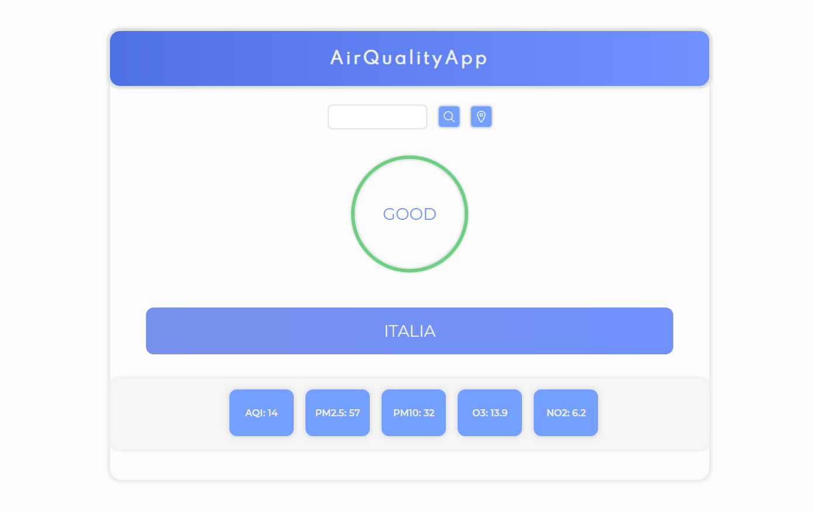
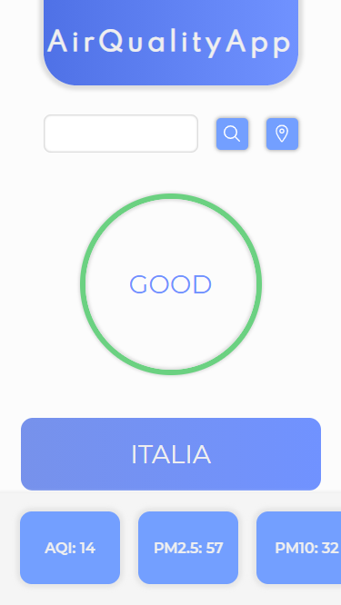

# air-quality-app-personal-proj
Just a practice and non-profit project for the Start2Impact web development course.
The API I'm using is the one of [The World Air Quality Project](https://aqicn.org/api/).

## How it works

You have two ways to obtain data from the API:
- Searching the city with the search bar
- Simply pressing on the geolocation button

Then you'll have a simple result in the middle of the screen and more details on the bottom (for smaller devices that is a scrollable section).

## How to build the app on your computer

You should first install Webpack in your project directory with these two terminal commands:

```
npm init -y
npm install webpack webpack-cli --save-dev
```

Then you should install the two libraries that I'm currently using for this project (Lodash and Jquery).
You can do it with the commands:

```
npm install --save lodash
npm install jquery
```

Then you should add your personal token for the API to work correctly and insert it in an .env file,
like in the example file in .env_example.

And last, you should run this command in your terminal to make your local webpack build of my project:

```
npm run build
```

## How does the app look like on your devices

### Larger devices like desktops, laptops and tablets



### Smaller devices like small tables and smartphones


